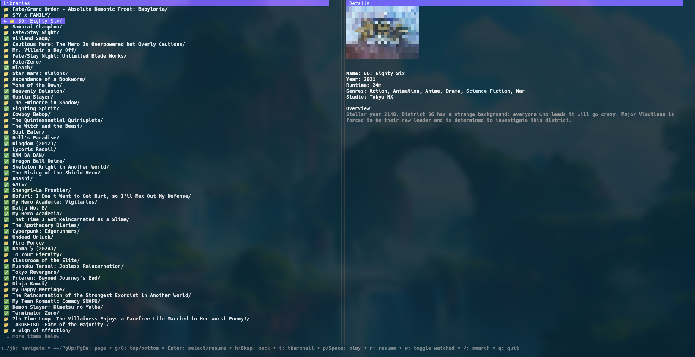

# JTUI - Jellyfin Terminal User Interface

A fast, efficient TUI (Terminal User Interface) for browsing and navigating your Jellyfin media server from the command line. Built with Go and optimized for performance.

> **Note**: This project has been vibecoded and optimized for enhanced performance and user experience.


## Screenshot



*Example of JTUI in action - browsing your Jellyfin media library from the terminal*

## Features

- 🚀 Fast and responsive terminal interface
- 📚 Browse your entire Jellyfin media library
- 🔍 Quick search functionality
- ▶️ Direct media playback with mpv
- 💾 **Download videos for offline viewing**
- 🔌 **Automatic offline mode when server unavailable**
- 📊 Continue watching and next up sections
- ✅ Mark items as watched/unwatched
- 🖼️ Thumbnail viewing support
- 🔐 Secure Quick Connect authentication
- ⌨️ Vim-style keyboard navigation

## Installation

### Prerequisites

- A running Jellyfin server
- `mpv` media player for video playback
- An image viewer (e.g., `xdg-open`, `feh`, etc.) for thumbnails

### Download Binary (Recommended)

Download the latest pre-compiled binary for your platform from the [releases page](https://github.com/Banh-Canh/jtui/releases):

```bash
# Download and install (Linux/macOS example)
curl -L -o jtui https://github.com/Banh-Canh/jtui/releases/latest/download/jtui-linux-amd64
chmod +x jtui
sudo mv jtui /usr/local/bin/

# Or download manually from: https://github.com/Banh-Canh/jtui/releases
```

**Available platforms:**
- Linux (amd64, arm64)
- macOS (amd64, arm64) 
- Windows (amd64)

### Build from Source (Alternative)

If you prefer to build from source or need a different platform:

```bash
# Requires Go 1.24+
git clone https://github.com/Banh-Canh/jtui.git
cd jtui
go build -o jtui
```

## Configuration

On first run, JTUI will create a configuration file at `~/.config/jtui/config.yaml` with default settings:

```yaml
jellyfin:
  server_url: "http://localhost:8096"
loglevel: "info"
image_viewer: "xdg-open"  # Optional: customize your image viewer
```

### Configuration Options

- **server_url**: Your Jellyfin server URL (required)
- **loglevel**: Logging level (`debug`, `info`, `error`)
- **image_viewer**: Command to open thumbnails (defaults to `xdg-open`)

### Download Storage

Downloaded videos are stored in `~/.config/jtui/downloads/` with the following structure:
```
~/.config/jtui/downloads/
├── Series/
│   └── Anime Name/
│       └── Season 01/
│           └── S01E01 - Episode Title.mkv
└── Movies/
    └── Movie Name (2024).mkv
```

## Usage

### Basic Usage

```bash
# Launch JTUI (will prompt for authentication if needed)
jtui

# Browse directly (if already authenticated)
jtui browse

# Show version
jtui --version

# Override log level
jtui --log-level debug
```

### Authentication

JTUI uses Jellyfin's Quick Connect feature for secure authentication:

1. **Enable Quick Connect** on your Jellyfin server:
   - Go to Jellyfin Dashboard → General → Quick Connect
   - Enable "Allow Quick Connect"

2. **Login Process**:
   ```bash
   jtui
   ```
   - JTUI will automatically detect if authentication is needed
   - A code will be displayed (e.g., `CODE: 123456`)
   - Enter this code in your Jellyfin web interface or mobile app
   - Click "Approve" when prompted
   - JTUI will automatically connect and save your session

3. **Session Management**:
   - Sessions are automatically saved to `~/.cache/jtui/session.txt`
   - JTUI will reuse valid sessions on subsequent runs
   - If a session expires, you'll be prompted to re-authenticate

### Navigation

JTUI supports both arrow keys and Vim-style navigation:

| Key | Action |
|-----|--------|
| `↑↓` / `j k` | Navigate up/down |
| `←→` / `h` / `Backspace` | Go back |
| `PgUp` / `PgDn` | Page up/down |
| `g` / `G` | Jump to top/bottom |
| `Enter` | Select item or play media |
| `Space` / `p` | Play selected media |
| `t` | View thumbnail |
| `w` | Toggle watched status |
| `d` | **Download video for offline viewing** |
| `x` | **Remove downloaded video** |
| `/` | Search |
| `q` / `Ctrl+C` | Quit |

### Features Overview

#### Library Browsing
- Navigate through your media libraries
- Browse folders and collections
- View detailed information for movies, TV shows, and episodes

#### Special Sections
- **Continue Watching**: Resume partially watched content
- **Next Up**: Next episodes in your TV series

#### Search
- Press `/` to enter search mode
- Type to search across your entire library
- Press `Enter` to execute search
- Press `Escape` to exit search mode

#### Media Playback
- Press `Space` or `p` to play media files
- Requires `mpv` to be installed and in your PATH
- Playback is tracked automatically in Jellyfin

#### Download & Offline Features
- **Download Videos**: Press `d` on any video to download it for offline viewing
- **Remove Downloads**: Press `x` to remove downloaded videos from local storage
- **Automatic Offline Mode**: When your server is unavailable, JTUI automatically switches to offline mode
- **Downloaded Content Library**: Access your offline content through the "Downloaded Content 💾" library
- **Smart Directory Structure**: Downloads respect Jellyfin's folder structure (Series/Season/Episode)
- **Local Playback**: Downloaded videos play directly from local files, no internet required
- **Visual Indicators**: Downloaded content shows 💾 icons for easy identification

#### Watch Status Management
- Press `w` to toggle watched/unwatched status
- Visual indicators show watch progress:
  - ✅ Fully watched
  - ⏸️ Partially watched (resume available)
  - ⭕ Unwatched
  - 📁 Folder
  - 💾 Downloaded content

## Troubleshooting

### Authentication Issues

1. **Quick Connect not working**:
   ```bash
   # Check if Quick Connect is enabled on your server
   curl http://your-server:8096/QuickConnect/Enabled
   ```
   Should return `true`

2. **Connection refused**:
   - Verify your server URL in `~/.config/jtui/config.yaml`
   - Ensure your Jellyfin server is running and accessible

3. **Session expired**:
   ```bash
   # Remove saved session to force re-authentication
   rm ~/.cache/jtui/session.txt
   ```

### Performance Issues

1. **Slow startup**:
   - Check network connectivity to your Jellyfin server
   - Try reducing log level: `jtui --log-level error`

2. **High memory usage**:
   - JTUI is optimized for performance with connection pooling
   - Memory usage should be minimal (<50MB typically)

### Playback Issues

1. **"mpv not found"**:
   ```bash
   # Install mpv
   # Ubuntu/Debian:
   sudo apt install mpv
   
   # macOS:
   brew install mpv
   
   # Arch:
   sudo pacman -S mpv
   ```

2. **Thumbnail viewing not working**:
   - Set your preferred image viewer in config:
     ```yaml
     image_viewer: "feh"  # or "eog", "gwenview", etc.
     ```

### Download & Offline Issues

1. **Download failed**:
   - Check available disk space in `~/.config/jtui/downloads/`
   - Verify you have write permissions to the downloads directory
   - Ensure stable internet connection during download

2. **Offline mode not working**:
   - Verify downloaded files exist in `~/.config/jtui/downloads/`
   - Check that mpv can play the downloaded files directly
   - Try: `mpv ~/.config/jtui/downloads/Series/*/Season*/S*E*.mkv`

3. **"Offline item not found" errors**:
   - This usually indicates corrupted downloads or file moves
   - Try removing and re-downloading the content:
     - Navigate to the content and press `x` to remove
     - Press `d` to re-download

4. **Downloads taking too long**:
   - Large video files may take significant time depending on your connection
   - Downloads continue in the background - you can continue browsing
   - Check progress in the terminal output during download

## Logs and Debugging

JTUI maintains comprehensive logs at `~/.config/jtui/jtui.log` for debugging purposes. All errors, connection issues, and internal operations are logged automatically:

```bash
# View recent logs
tail -f ~/.config/jtui/jtui.log

# Enable debug logging for more detailed output
jtui --log-level debug

# View logs in real-time while using the application
tail -f ~/.config/jtui/jtui.log | jq .  # Pretty-print JSON logs
```

**What gets logged:**
- Authentication attempts and errors
- Network connection issues  
- API request failures
- Application crashes and panics
- Configuration loading errors
- Media playback events
- Download progress and errors
- Offline mode transitions
- File system operations

**Log Levels:**
- `error`: Only critical errors
- `info`: Normal operation info (default)
- `debug`: Detailed debugging information

## Performance Features

This vibecoded version includes several performance optimizations:

- **Enhanced HTTP Connection Pooling**: Up to 50 concurrent connections with 90s keep-alive
- **Reduced Memory Allocations**: Pre-computed strings and efficient viewport management
- **Optimized UI Rendering**: Consolidated viewport calculations and reduced redundant operations
- **Smart Authentication**: Prioritized authentication methods for faster login
- **Efficient Error Handling**: Structured logging and graceful error recovery

## Contributing

Contributions are welcome! Please feel free to submit issues and pull requests.

## License

Copyright © 2024 Victor Hang

This project is licensed under the MIT License - see the LICENSE file for details.

## Acknowledgments

- Built with [Bubble Tea](https://github.com/charmbracelet/bubbletea) TUI framework
- Uses [Lip Gloss](https://github.com/charmbracelet/lipgloss) for styling
- Powered by the [Jellyfin](https://jellyfin.org/) media server

---

*This project has been vibecoded for optimal performance and user experience.*